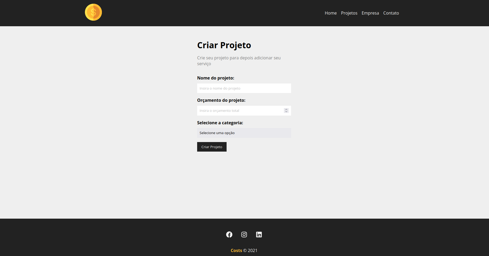
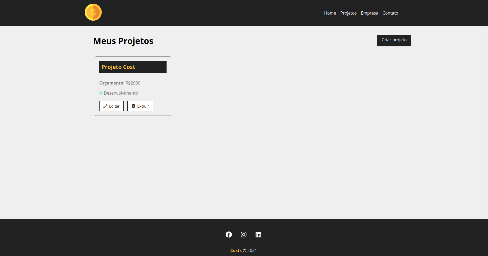
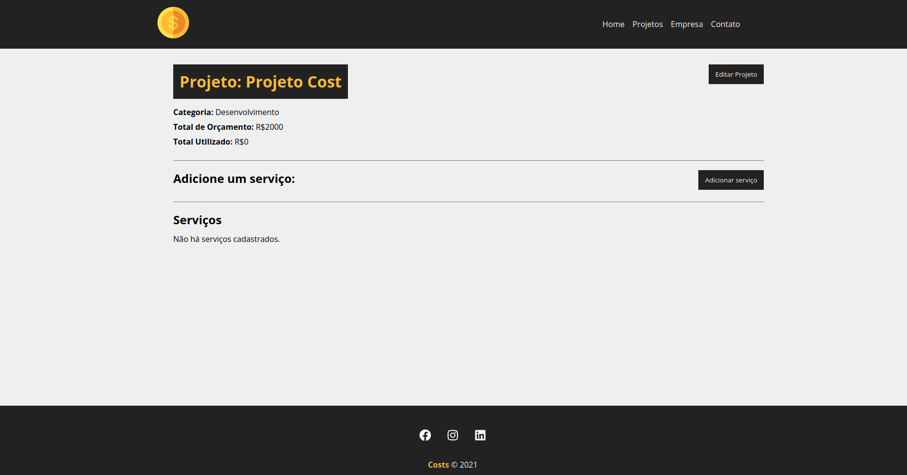
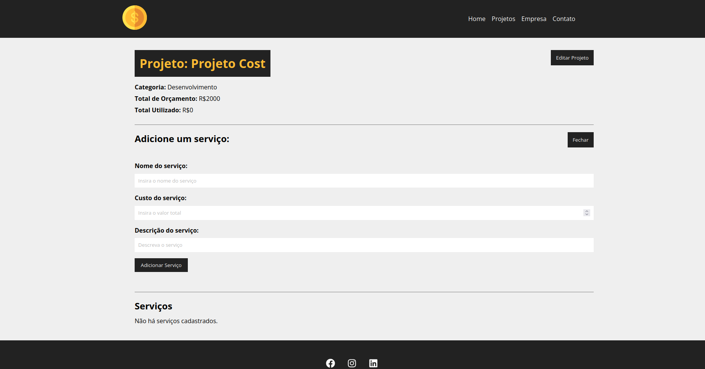
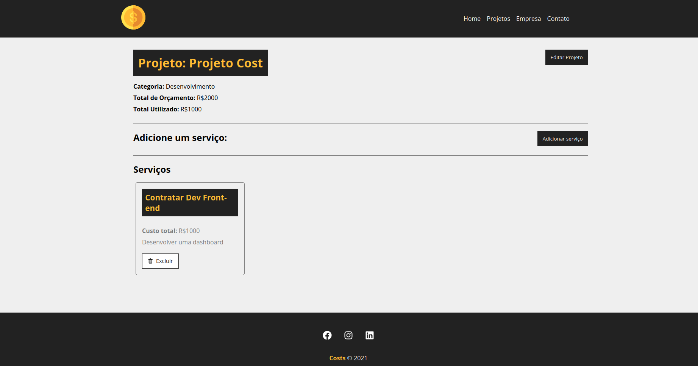

## Dependências:

- npm install
- npm list -g react-scripts
- npm install -g react-scripts
- npm start
- npm run backend  -> ativar a API

## Home

## Formulário de criação do projeto

## Exibição dos projetos

## Detalhe do projeto

## Criação de serviço no projeto

